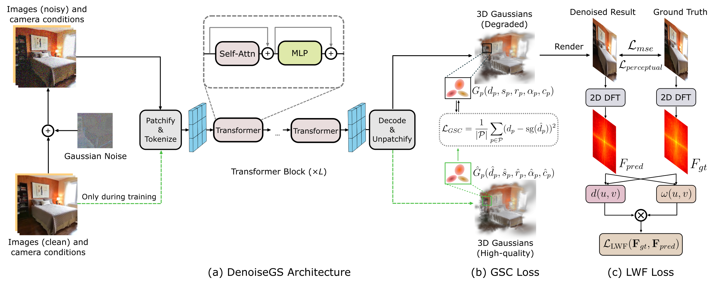
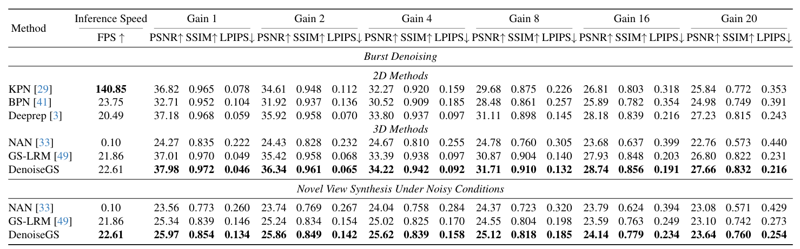
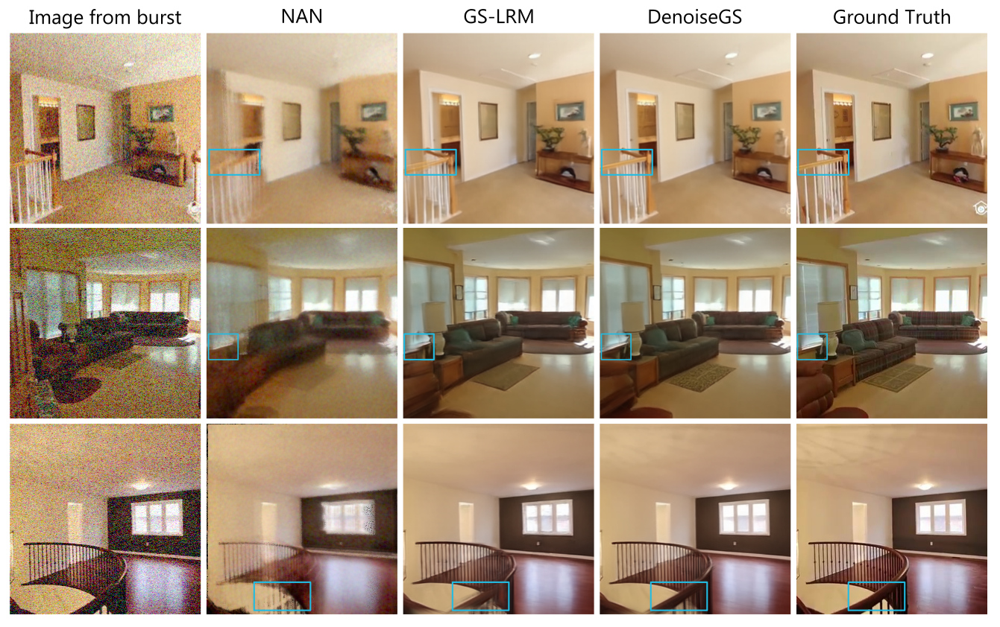

# DenoiseGS: Gaussian Reconstruction Model for Burst Denoising
[Yongsen Cheng](https://github.com/yscheng04), [Yuanhao Cai](https://caiyuanhao1998.github.io/), [Yulun Zhang](http://yulunzhang.com/),"DenoiseGS: Gaussian Reconstruction Model for Burst Denoising", arXiv, 2025

[](https://arxiv.org/abs/2511.22939)

#### 🔥🔥🔥 News

- **2025-11-27:** This repo is released.

---

> **Abstract:** Burst denoising methods are crucial for enhancing images captured on handheld devices, but they often struggle with large motion or suffer from prohibitive computational costs. In this paper, we propose DenoiseGS, the first framework to leverage the efficiency of 3D Gaussian Splatting for burst denoising. Our approach addresses two key challenges when applying feedforward Gaussian reconsturction model to noisy inputs: the degradation of Gaussian point clouds and the loss of fine details. To this end, we propose a Gaussian self-consistency (GSC) loss, which regularizes the geometry predicted from noisy inputs with high-quality Gaussian point clouds. These point clouds are generated from clean inputs by the same model that we are training, thereby alleviating potential bias or domain gaps. Additionally, we introduce a log-weighted frequency (LWF) loss to strengthen supervision within the spectral domain, effectively preserving fine-grained details. The LWF loss adaptively weights frequency discrepancies in a logarithmic manner, emphasizing challenging high-frequency details. Extensive experiments demonstrate that DenoiseGS significantly exceeds the state-of-the-art NeRF-based methods on both burst denoising and novel view synthesis under noisy conditions, while achieving \textbf{250$\times$} faster inference speed.

## ⚒️ TODO

* [ ] Release code and pretrained models

## 🔎 Method Overview



## <a name="results"></a>🔎 Results

<summary>Quantitative Results</summary>

- Results in Tab. 1 of the main paper

<p align="center">
  
</p>


<summary>Qualitative Results on Burst Denoising</summary>

- Results in Fig. 5 of the main paper

<p align="center">
  
</p>
<summary>Qualitative Results on Novel View Synthesis under Noisy Conditions</summary>

- Results in Fig. 6 of the main paper

<p align="center">
  
</p>


## <a name="citation"></a>📎 Citation

If you find the code helpful in your research or work, please cite our work.

```
@inproceedings{Cheng2025denoisegs,
    title={DenoiseGS: Gaussian Reconstruction Model for Burst Denoising},
    author={Cheng, Yongsen and Cai, Yuanhao and Zhang, Yulun},
    journal={arXiv preprint arXiv:2511.22939},
    year={2025}
}
```